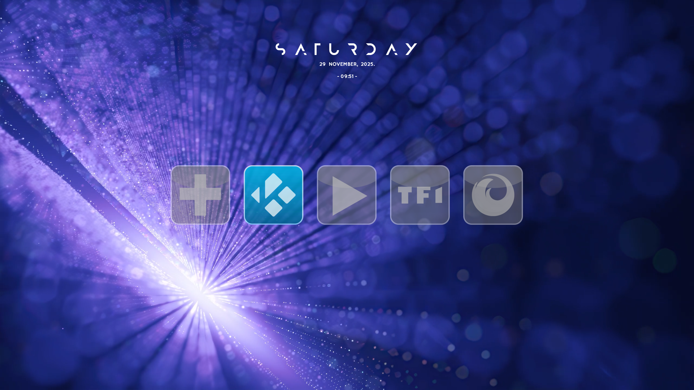
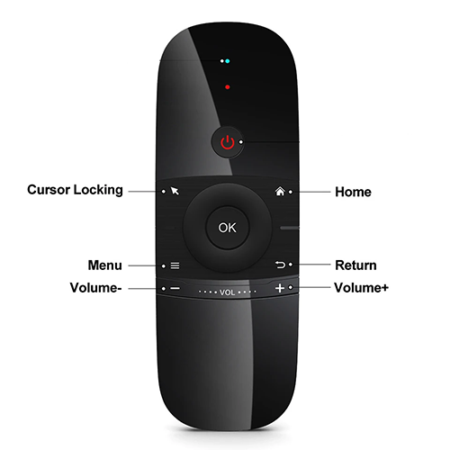
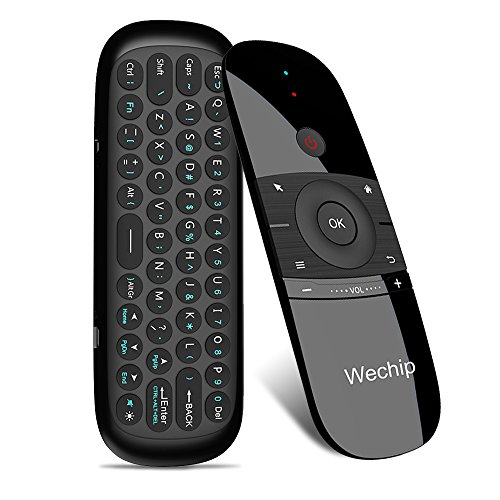

# LivelyHTPC
**Lively HTPC Launcher** – A beautiful, remote-friendly media application launcher for your Home Theater PC


[](https://github.com/Veda-I/LivelyHTPC/releases/latest)
[](https://github.com/Veda-I/LivelyHTPC/releases)
[](https://www.rainmeter.net)
[](https://www.autohotkey.com)

> **No mouse. No keyboard. Just your remote or arrow keys.**  
> LivelyHTPC turns your Windows PC into a true 10-foot interface featuring a beautiful horizontal scrolling bar of your favorite media apps, a clock, and a built-in music player + playlist selector + visualizer.

## 🧭 Menu
- [🏠 Home](#livelyhtpc)
- [Features](#-features)
- [Demo](#-demo)
- [Screenshots](#-screenshots)
- [Quick Start](#-quick-start)
- [Configuration](#️-configuration)
- [Recommended Setup (Best Experience)](#-recommended-setup-best-experience)
- [Navigation](#-navigation)
- [Extras](#-extras)
- [License](#-license)
- [Support & Community](#-support--community)
- [Credits](#-credits)
---

## ✨ Features

- Fully navigable with **remote control** or **arrow keys + enter/back buttons**
- Dynamic horizontal icon bar (auto-scroll, smooth animations)
- Built-in **clock** and **music player** with playlist support and music visualizer
- Designed for **Rainmeter + AutoHotkey v2**
- Zero mouse required after setup

## 🎥 Demo
| |
| :------------------------------------: |
[](https://youtu.be/Z62YdKrJ8kk)

## 📸 Screenshots

| Classic Layout                  | Playlist Mode                  | Music Player               | Visualizer Mode               | Hidden Mode               |
|----------------------------------|----------------------------------|----------------------------------|----------------------------------|----------------------------------|
| [](Doc/Images/Classic.png) | [](Doc/Images/Playlist.png) | [](Doc/Images/Music.png) | [](Doc/Images/Visualizer.png) | [](Doc/Images/Hidden.png) |

## 🚀 Quick Start

### 💠 Prerequisites

- Windows 10 or **Windows 11** (recommended)
- [Rainmeter](https://www.rainmeter.net) ≥ 4.5
- [AutoHotkey v2](https://www.autohotkey.com) installed
- (Optional) [Wallpaper Engine](https://store.steampowered.com/app/431960/Wallpaper_Engine/) or [Lively Wallpaper](https://rocksdanister.com/lively/)
- (Optional) [Keyboard Surfing](https://addons.mozilla.org/en-US/firefox/addon/keyboard-surfing/) (Firefox Add-on by [Somnia](https://addons.mozilla.org/en-US/firefox/user/12273604/))

### 💠 Installation

1. Download/Unzip the latest `LivelyHTPC_x.x.zip` from [Releases](https://github.com/Veda-I/LivelyHTPC/releases/latest)
2. Double-click `InstallRainmeterPlugins.bat` to copy the 2 plugins into the Rainmeter **Plugins** folder (or manually)
3. Double-click `LivelyHTPC_x.x.rmskin`
4. Rainmeter will open → click **Install**
5. Install **Skins** & **Layout** (keep default options for first install)
6. Done! The skin loads automatically


## ⚙️ Configuration

> Press **F9** if the skin is already active in order to have your taskbar visible (and access Rainmeter)

### 💠 Rainmeter 

In Rainmeter Manager : **Manage  → Settings**

- Check **Enable hardware acceleration**

In Rainmeter Manager : **Manage  → Skins → LivelyHTPC**

- Select **Player.ini**, **Clock.ini**, **Visualizer.ini**, **Playlist.ini** 
to adjust their positioning based on your preferences and screen resolution. The default layout is optimized mainly for 2K resolution. Play with `ClockScale` value too in `Variables.Inc` (see below in [Configuration](#️-configuration) section)

Example: 

2K    : `VisibleIcons=5` `IconSize=220` `IconSpacing=50` `ClockScale=1`

1080p : `VisibleIcons=5` `IconSize=180` `IconSpacing=50` `ClockScale=0.75`

| Ini| 2K Resolution | 1080p Resolution |
|-|----------------|------------------|
|  Player.ini      |  X=960,Y=60   | X=640,Y=60  |
|  Clock.ini       |  X=950,Y=150  | X=710,Y=150 |
|  Visualizer.ini  |  X=1060,Y=260 | X=740,Y=200  |
|  Playlist.ini    |  X=925,Y=1260 | X=600,Y=880  |


> Make sure the player is positioned above the icon bar (and the playlist below), otherwise navigation will be confusing 🙃😁

### 💠 Variables.inc 

In Skins folder : **Skins  → LivelyHTPC  → @Resources**  → `Variables.inc`

You can customize:
- Icon order & custom apps
- Icon size & spacing
- Visible Icons & total icons
- Clock format (12h/24h)
- Music files & playlists
- Colors, language, animation speed, etc.

Edit values based on your preferences and save `Variables.inc`.

---

#### ⏹️ General

##### 🔹Total Icons
```ini
IconCount = 11           ; ← all the icons/apps available (max : 20 icons)
```
#####  🔹Visible Icons
```ini
VisibleIcons = 5         ; ← visible icons at the same time (recommended 4-5)
```
#####  🔹Icon Size and Spacing
```ini
IconSize=220             ; ← icon width & height
IconSpacing=50           ; ← icon spacing
```
#####  🔹Default Icon selected
```ini
StartPosition = 2        ; ← which icon is selected by default (min : 1, max : VisibleIcons)
```
#####  🔹Main & Select Color
```ini
MainColor=255,125,253    ; ← main RGB color used by player, visualizer, playlist
SelectColor=252,255,125  ; ← RGB color used by player, visualizer, playlist when selection
```
#####  🔹Clock Settings
```ini
ClockScale=1             ; ← scale of the clock display (decimal; e.g., 0.75 for 1080p, 1 for 2K)
ClockFormat24H=1         ; ← choose the time format: 24H or 12H [0 or 1]
Language=English         ; ← language used (French or English available by default)
```
> You can create your own language file by copy/paste/edit/rename **@Resources  → Language**  → `English.inc` and change after, **Language** accordingly.


### ⚙️⚙️⚙️ [Full configuration Guide](Doc/Configuration.md)   → [Here](Doc/Configuration.md)  ⚙️⚙️⚙️  ❤️


## 🎨 Recommended Setup (Best Experience)

For the ultimate couch experience:

- **Wallpaper Engine** or  **Lively Wallpaper** as animated background
- Firefox with **[Keyboard Surfing extension](https://addons.mozilla.org/firefox/addon/keyboard-surfing/)**
- **Windows 11** + latest **AutoHotkey v2**
- A good universal remote (Wechip Air Mouse, FLIRC, Harmony, etc.)

Tested with **Wallpaper Engine** and **Wechip Air Mouse**

### 💠 Firefox & Chrome

The message "Open Firefox in recovery mode?" appears when Firefox detects that it has been improperly closed several times in a row—typically what happens when you perform a hard kill in kiosk mode.

Fortunately, you can permanently disable this prompt.

Solution: 
1. Open Firefox as usual.
2. In the address bar, type: `about:config`
3. Search for `toolkit.startup.max_resumed_crashes` and set it to **-1**
4. Search for `browser.safemode.enabled` and set it to **false**

For Chrome, just add this argument when you call it : `--disable-session-crashed-bubble`

## ⚓ Navigation

Quick explanation of how to navigate.


- **Left** & **Right** arrows for the navigation bar (Press **Enter** to launch app)
- **Up** & **Down** arrows to access your   **playlists** or your  **music player**
- **Left** & **Right** arrows to navigate in your  **playlists** or your  **music player** options (Press **Enter** to launch actions)

### 💠 Remote Control

Here are the available actions for your remote control.
I use a **WeChip Air Mouse**, so the example is based on it.

|                         |                         |
|----------------------------------------|----------------------------------------|
|    |     |

1. **OK** and **Touching wheel** are corresponding to **Enter button and Left, Right, Up, Down arrows**. **Return** button stays the same
2. **Home** is used for force exit from kiosk application (hard kill) (🛟 **F10** do the same)
3. **Menu** can be used to hide/show the whole skin and the **windows taskbar** (🛟 **F9** do the same)
4. **Menu** can be used to toggle **Keyboard Surfing** on **Firefox**

> 🛟 **F7** can be used as an emergency button to hide/show the windows taskbar (even if **Menu**/**F9** do the same)

## 🎁 Extras

### 💠 Wallpapers
You can find some dynamic wallpapers I use in **@Resources  →  Extras   →  Wallpapers** (not in .rmskin file but here in GitHub)

### 💠 Cursor
You can tweak your mouse pointer to be less visible when idle.
You can find some cursor files (.cur) in **@Resources  →  Extras   →  Cursors**. Go to Windows **→  Settings   →  Accessibility →  Mouse pointing and touch interaction →  Customize the pointer image**

### 💠 Icon Templates

In **@Resources  →  Extras   →  Icons  →  Psd**, you got 2 **PSD Files** if you want to customize your own icons but using the same type of display of the icons provided by the skin (corresponding to your own apps : Netflix, Plex etc..)

## 📄 License

This project is licensed under the GNU General Public License v3.0 – see [LICENSE](LICENSE) for details.

## 💬 Support & Community

- Open an [Issue](https://github.com/Veda-I/LivelyHTPC/issues)
- Discussion & showcase: [GitHub Discussions](https://github.com/Veda-I/LivelyHTPC/discussions)
- **LivelyHTPC** was originally created for my personal use, but I decided it could be useful to share with the community
- 🚧 I’m not planning to actively add new features in the future but if there is skilled people who want to endorse and participate to this projet for future improvements, contact me 💕

## 🎗️ Credits

- **Clock** & **Visualizer** based on **[mond](https://www.deviantart.com/apexxx-sensei/art/Mond-762455575)** and **[robik](https://www.deviantart.com/apexxx-sensei/art/Robik-771914763)** by **[@apexxx-sensei](https://www.deviantart.com/apexxx-sensei)** 
- **Player** based on  **[squareplayer](https://www.deviantart.com/meti0x7cb/art/SquarePlayer-3-4-846095708)** by **[@meti0x7cb](https://www.deviantart.com/meti0x7cb)**
- **WebNowPlaying Plugin** - **[@tjhrulz](https://github.com/tjhrulz/WebNowPlaying)** & **[@keifufu](https://github.com/keifufu)**
---
Made with ❤️ for the HTPC community  

*Turn your PC into a real media center – no mouse required.*


